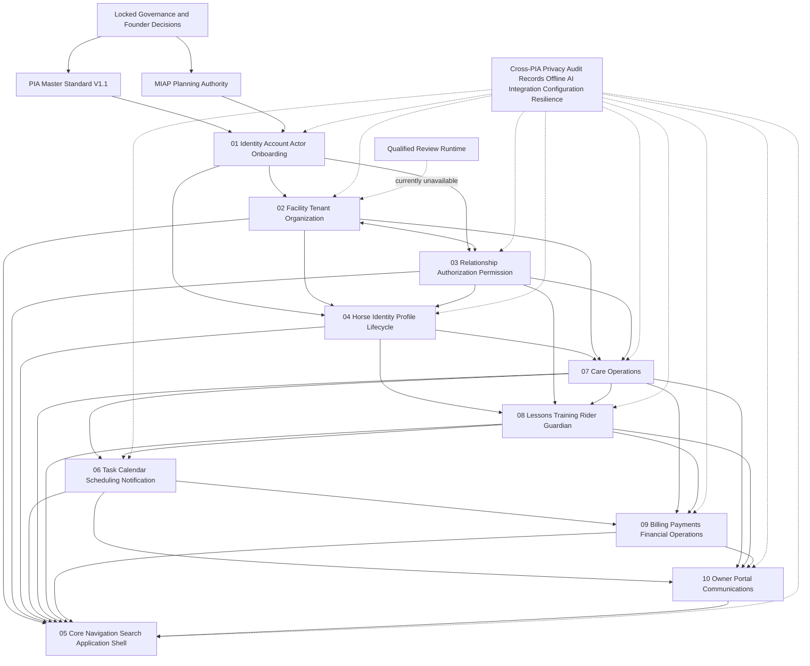

# Remaining PIA Dependency Graph

**Status:** `RECOMMENDED_NOT_APPROVED`  
**Implementation authority:** `FALSE`

Arrows express authority or contract dependencies, not implementation sequence alone. The bidirectional 02/03 edge must be resolved through explicit interfaces: context informs permission evaluation, while authority constrains who may create, change, or use facility/tenant/organization records.
