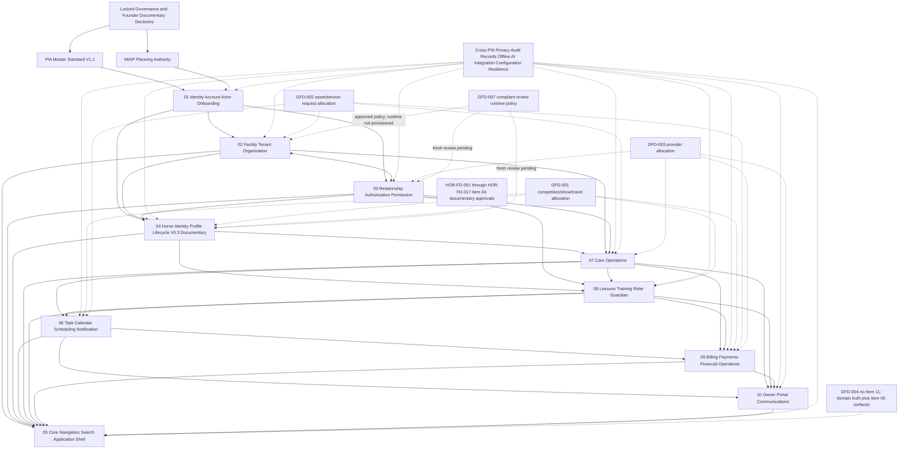

# Remaining PIA Dependency Graph

**Status:** `ITEM04_DOCUMENTARY_DESIGN_INTEGRATED_FOUNDER_APPROVED_PENDING_REVIEW`
**Implementation authority:** `FALSE`

Arrows express documentary authority or contract dependencies, not implementation sequence or execution authority. Item 04 V0.3 may inform downstream documentary drafting, but it is not independently reviewed, adopted, ratified, implementation-ready, operational, released, or enrollment-ready. The GFD and HOR-FD approvals do not provision a review runtime, change schemas, modify product behavior, or authorize deployment.
